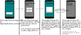

# Offline REST Recipe for Native Apps

<<<<<<< HEAD
[Diagram](img/offline-rest-flow-b.svg)

**Scenario**: The user has two apps on their phone that need to talk to each other offline, for example a learning management system app and a math app. In the online world there are well defined REST HTTP APIs that would enable these apps to talk to each other e.g. [LTI](https://www.1edtech.org/standards/lti).

**Problem**: It's not possible to run a local server continuously on a mobile device due to background execution limits on [Android](https://developer.android.com/about/versions/oreo/background) and [iOS](https://developer.apple.com/forums/thread/685525). Continuous background services would reduce battery life and performance.

**Solution**: REST HTTP requests can be serialized and sent from the client app using a [bound service](https://developer.android.com/develop/background-work/services/bound-services) on Android or [XPC service](https://developer.apple.com/documentation/xpc) on iOS). The operating system will "wake up" the server app as required.

The learning management system can provide a parameter ```ipc-service``` when launching a Uri to start a lesson in the math app. The math app can then access REST APIs by sending HTTP requests using the IPC service identified by the ```ipc-service``` parameter.

**Why is this needed?**: There are many instances where there are well developed standards for interoperability using http, but there are no equivalent standards using IPC for mobile operating systems. Server apps could use peer-to-peer sync, local-first techniques, or others to take care of synchronizing data locally or with the Internet when a connection is available such that the client app (e.g. the math app) doesn't have to worry about this. 

### Offline OAuth flow

[Diagram](img/offline-rest-flow-a.svg)

=======


Scenario: 

The user has an API provider app (e.g. a Learning Management System app) and a client app (e.g. a math app). In the online world there are well defined REST HTTP APIs that would enable these apps to talk to each other; typically using [OAuth](https://oauth.net/2/) for the client to get a token, and then using a REST API to access information (e.g. student grade level and class enrollment information using [OneRoster](https://www.1edtech.org/standards/oneroster) or student progress information using [xAPI](https://xapi.com)).

>>>>>>> ec4ffbb6b24e9d6e9bbc9df3c499ced702c6ef2c
[RFC8252](https://datatracker.ietf.org/doc/html/rfc8252) describes how native apps can use OAuth to get an access token.

This could work as follows:

* The client app launches the link e.g. ```https://auth-server.com/auth``` which will launch the authorization app if it is installed (using App Links on Android and claimed https URIs on iOS). If the authorization app is not installed and connectivity is available then the client app can use the system browser as per RFC8252.

* The authorization app allows the user to accept or deny the request. If the user accepts it launches the redirect link specified by the client e.g. ```com.example.app://auth-done``` and includes a ```code``` parameter to redeem for a token (as per standard OAuth) and an ```ipc-service``` parameter.

* The client app binds to the service specified by the ```ipc-service``` parameter (using a [bound service](https://developer.android.com/develop/background-work/services/bound-services) on Android or [XPC service](https://developer.apple.com/documentation/xpc) on iOS).

* The client app sends a REST API request to the API app (which may, as per the OAuth spec, be the same as the authorization app) by serializing the HTTP request into bytes which are then received by the API app using the IPC service, which in turn serializes its response into bytes for the client app. The client app can now use the same API it would use in an online scenario without requiring Internet access. If authorization took place online (e.g. the authorization app was not installed), then no ```ipc-service``` parameter would be provided and the client app can use the HTTP API over the network.

* The client app MAY use a library such that it can access the API using normal http via an embedded localhost server instead of directly serializing http requests itself.
  
* The API app may take care of synchronizing user data for offline use so that client apps can work offline without having to implement offline sync themselves.

* A client app may obtain a token separately using an SDK or where it launched by a link (e.g. where a Learning Management System app launches the math app with a link for a specific lesson including credentials for the students session as happens using xAPI via [CMI-5](https://xapi.com/cmi5/overview/)). The client app can still use the REST over IPC to access the API provider app as long as the link includes the ```ipc-server``` parameter.

Status:

This is a very rough draft intended to facilitate discussion and comments. Issues, suggestions etc. are welcome

